<h1 align="center">ALVARO MARQUES</h1>

---

Sou estudante de Ciência da Computação!

Atualmente estou focando meus estudos em **programação, desenvolvimento de sistemas e Inteligência Artificial**.

Tenho interesse em tecnologias como **Python, C, HTML, CSS e JavaScript**, além do desenvolvimento de soluções utilizando **IA**.

Busco constantemente aprimorar meus conhecimentos e desenvolver novos projetos na área de tecnologia.

---

## 📊 GitHub Stats

  
  

---

## 📫 Contato
---

## 💻 Tecnologias

    

---

## 📫 Contato

